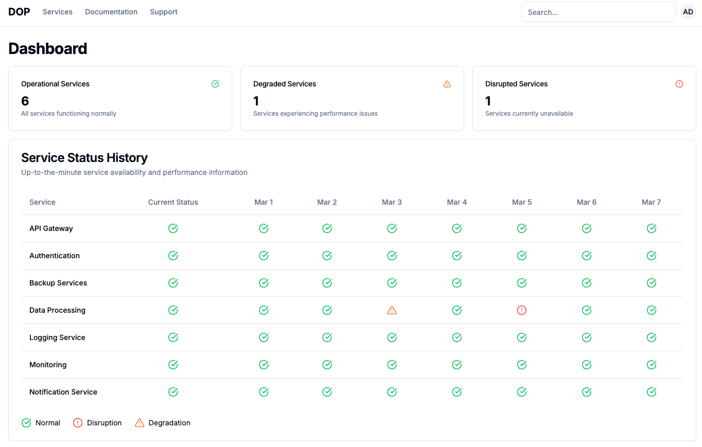
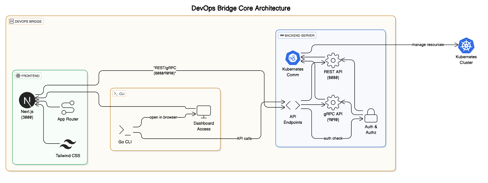

# DevOps Bridge

A tool between developers and complex backend infrastructure. It gives developers the edge they need to succeed while simplifying platform complexities.

<div align="center">
  
  <p><em>Admin Dashboard Mockup</em></p>
</div>

## Key Features
- Modern microservices architecture with Go backend, Next.js frontend, and CLI
- Next.js App Router for efficient routing and built-in authentication
- Modern UI stack with Next.js 14, shadcn/ui components, and Tailwind CSS
- Clean and minimalist design with responsive layout and dark mode support
- Type-safe development with TypeScript and component-based architecture
- Kubernetes integration for managing containerized applications
- Comprehensive API support with both REST and gRPC endpoints
- Easy installation via custom Homebrew tap with automatic updates
- Extensible architecture allowing custom integrations, UI components, and CLI extensions

## Table of Contents

1. [Installation](#installation)
   - [Prerequisites](#prerequisites)
   - [Installing via Homebrew](#installing-via-homebrew)
   - [Manual Installation](#manual-installation)
2. [Architecture](#architecture)
3. [Project Structure](#project-structure)
4. [Development Setup](#development-setup)
   - [Backend Server](#backend-server)
   - [Frontend Development](#frontend-development)
   - [CLI](#cli)
5. [API Documentation](#api-documentation)
6. [Authentication](#authentication)
7. [Contributing](#contributing)

## Installation

### Prerequisites

- Go 1.19+ (required for backend server and CLI)
- Node.js 18+ (required for frontend development, recommended for Next.js 14)
- npm 9+ or yarn (required for frontend development)
- Kubernetes cluster or minikube (required only for backend server functionality, not needed for dashboard UI)

### Installing via Homebrew

You can install the DevOps CLI using Homebrew:

1. Add the custom tap:
```bash
brew tap sysintelligent/sysintelligent
```

2. Install the CLI:
```bash
brew install dopctl
```

3. Verify the installation:
```bash
dopctl version
```

### Cleanup

To remove the DevOps CLI and clean up the Homebrew tap:

1. Uninstall the CLI:
   ```bash
   brew uninstall dopctl
   ```

2. Remove the custom Homebrew tap:
   ```bash
   brew untap sysintelligent/sysintelligent
   ```

### Manual Installation

1. Clone the repository:
```bash
git clone https://github.com/sysintelligent/devops-bridge.git
cd devops-bridge
```

2. Build the CLI:
```bash
cd cmd/dopctl
go build -o dopctl
```

3. Move the binary to your PATH:
```bash
sudo mv dopctl /usr/local/bin/
```

## Architecture



DevOps Bridge uses a modern, microservices-based architecture:

1. **Backend Server (Go)**
   - REST API on port 8080
   - gRPC API on port 9090
   - Handles Kubernetes communication
   - Manages authentication and authorization
   - Provides API endpoints for frontend and CLI

2. **Frontend (Next.js)**
   - Runs on port 3000
   - Modern React-based application
   - Communicates with backend via API
   - Built with Next.js App Router
   - Styled with Tailwind CSS

3. **CLI (Go)**
   - Command-line interface for DevOps Bridge
   - Integrates with both backend and frontend
   - Provides dashboard access via browser

## Project Structure

The project is organized into three main components:

```
devops-bridge/
├── ui/                   # Next.js TypeScript frontend
│   ├── src/              # Source code directory
│   │   ├── app/          # Next.js App Router pages and layouts
│   │   ├── components/   # Reusable UI components
│   │   ├── lib/          # Utility functions and shared code
│   │   └── globals.css   # Global styles and Tailwind configuration
│   ├── public/           # Static assets
│   └── scripts/          # Build and utility scripts
├── server/               # Go backend server
│   ├── api/              # REST and gRPC API definitions
│   ├── auth/             # Authentication and RBAC
│   └── kubernetes/       # Kubernetes client integration
└── cmd/                  # CLI implementation using Cobra
    └── dopctl/           # CLI source code
└── dist/                 # Package distribution files
    └── homebrew/         # Homebrew formula for CLI installation
        └── dopctl.rb     # Homebrew formula definition
```   

## Development Setup

### Backend Server

1. Start the Go backend server:
```bash
cd server
go mod tidy
go run main.go
```

The server will start on:
- HTTP API: http://localhost:8080
- gRPC: localhost:9090

2. Test the server using curl:
```bash
curl http://localhost:8080/health
```
You should see "OK" as the response if the server is running correctly.

### Frontend Development

1. Install dependencies:
```bash
cd ui
npm install
```

2. Start the development server:
```bash
npm run dev
```

The UI will be available at http://localhost:3000

3. **Build the UI for production or packaging:**
```bash
npm run build
```
This will build the latest UI assets. The build step is also automatically run as part of the release process in `dist/homebrew/update_version.sh`.

#### Importing Components from v0.dev

To import components from v0.dev into your project:

1. Navigate to the UI directory:
```bash
cd ui
```

2. Run the shadcn command with your v0.dev component URL:
```bash
npx shadcn@2.3.0 add "your-v0-dev-component-url"
```

This will:
- Download the component code from v0.dev
- Add any necessary shadcn-ui component dependencies
- Create the component file in your project
- Add required imports and styles

After importing, you can use the component in your pages or components. You may need to restart your development server after adding new components.

### CLI

1. Build the CLI:
```bash
cd cmd/dopctl
go build -o dopctl
```

2. Open the dashboard:
```bash
./dopctl admin dashboard
```

This will start the Next.js server if not running and open the dashboard in your browser.

## API Documentation

The backend provides the following API endpoints:

### REST API (Port 8080)

- `GET /health` - Health check endpoint
- `GET /api/applications` - List all applications
- `GET /api/applications/{name}` - Get application details
- `POST /api/applications` - Create new application
- `PUT /api/applications/{name}` - Update application
- `DELETE /api/applications/{name}` - Delete application
- `GET /api/settings` - Get settings
- `PUT /api/settings` - Update settings

### gRPC API (Port 9090)

- ApplicationService
  - GetApplications
  - GetApplication
  - CreateApplication
  - UpdateApplication
  - DeleteApplication

## Authentication

The server supports two types of authentication tokens:

1. **Admin Token**
   - Full access to all endpoints
   - Token: `admin-token`
   - Example: `curl -H "Authorization: Bearer admin-token" http://localhost:8080/api/applications`

2. **Demo Token**
   - Read-only access to applications and settings
   - Token: `demo-token`
   - Example: `curl -H "Authorization: Bearer demo-token" http://localhost:8080/api/applications`

## Contributing

1. Fork the repository
2. Create your feature branch
3. Commit your changes
4. Push to the branch
5. Create a new Pull Request